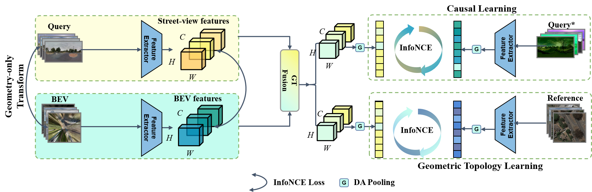

# CVGL: Causal Learning and Geometric Topology

In this repository we present our NeurIPS accepted work: "CVGL: Causal Learning and Geometric Topology" and provide training and inference code. 


*CLGT Architecture*

> Cross-view geo-localization (CVGL) aims to estimate the geographic location of a street image by matching it with a corresponding aerial image. This is critical for autonomous navigation and mapping in complex real-world scenarios. However, the task still faces numerous challenges, such as significant viewpoint differences and the influence of confounding factors. To tackle these issues, we propose a framework, Causal Learning and Geometric Topology (CLGT), which integrates two key components: a Causal Feature Extractor (CFE) that mitigates the influence of confounding factors and borrows the concept of causal intervention to encourage the model to focus on stable, task-relevant semantics; and a Geometric Topology Fusion (GT Fusion) module that injects Bird’s Eye View (BEV) road topology into street features to alleviate cross-view inconsistencies caused by extreme perspective changes. Additionally, we introduce a Data-Adaptive Pooling (DA Pooling) module to enhance the representation of semantically rich regions. Extensive experiments on CVUSA, CVACT, and robustness-enhanced variants (CVUSA-C-ALL and CVACT-C-ALL) demonstrate that CLGT achieves state-of-the-art performance, particularly under challenging real-world corruptions.

For training and testing the provided code download the datasets and extract them as shown in the folder structure. 
Afterwards for each dataset a unique train script can be executed. 

We provide a requirements.txt file to ensure compatibility.

## Folder Structure:

```
├── dataset/
  ├── VIGOR/ 
  ├── CVUSA/	
  └── CVACT/
├─ CLGT
  └──CLGT/
```

